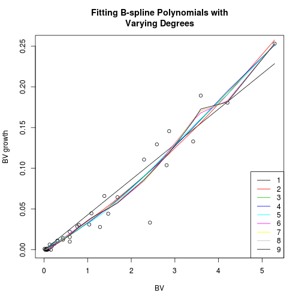

Compare B-splines of varying degrees
========================================================

See how additional degrees of polynomial fits effect the fit of bole volume growth to previous bole volume for Doug Firs.  These are polynomial fits with no intercept from B-splines of varying degrees (also no intercept).  Fit comparisons are in [intercept](https://github.com/ghandi9000/rgr/tree/master/rgr-hazards/version2/intercept).

This is data from Install 1, plot 10, year '76.

 

