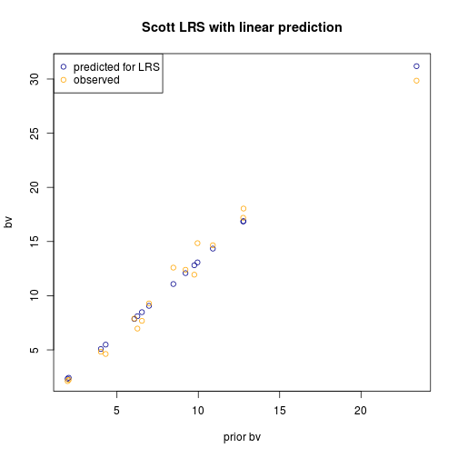
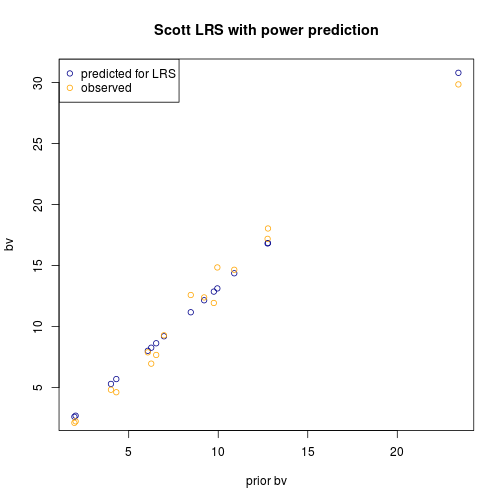

## Compute Scotts's version of LRS
* Formula:
$LRS = \frac{prior + predicted_growth}{max(current)}$

where $prior$ is the prior size, $predicted_growth = a * (current-prior) + b$, and $current$ is the size at the end of the period.

## Questions:
* Was the predicted fit just a linear fit?


```r

## Returns LRS given prior and current size values (i.e. priorbv and bv)
## Options for prediction are: linear, power LRS = (priorbv + predicted
## bvgrowth) / (max bv at end of period)
scottLRS <- function(prior, current, model = "linear") {
    fit <- lm((current - prior) ~ prior)
    if (model == "power") 
        fit <- nls((current - prior) ~ a * prior^b, start = list(a = 1, b = 1))
    LRS = (prior + predict(fit, data.frame(prior = prior, current = current)))/max(current, 
        na.rm = T)
    return(LRS)
}

```


## Test data

```r

dat <- read.csv("~/work/data/data/long-bc-derived.csv")
dat <- subset(dat, spec == "FD" & stat == "ALIVE" & bvgrowth >= 0)  # just firs that were alive and grew
```


## Try plot with most deviation in residuals after fitting with linear fit

```r

library(plyr)
dd <- dat[dat$time > 76, ]
pps <- ddply(dd, .(install, plot, time), function(x) {
    data.frame(sdres = sd(lm((x$bv - x$priorbv) ~ x$priorbv)$residuals))
})
worst <- pps[which.max(pps$sdres), ]
tst <- dat[dat$install == worst$install & dat$plot == worst$plot & dat$time == 
    worst$time, ]

## Compute the lrs values using linear fit
tst$lrs <- scottLRS(prior = tst$priorbv, current = tst$bv, model = "linear")

```


### Linear fit for predicted bole volume growth

```r
library(ggplot2)
fit <- lm((tst$bv - tst$priorbv) ~ tst$priorbv)
tst$preds <- fit$fitted.values
## Correlation
corr <- cor((tst$preds - tst$bv), tst$priorbv)
corr
```

```
## [1] -0.985
```

```r
plot(tst$priorbv, tst$priorbv + tst$preds, col = "dark blue", xlab = "prior bv", 
    ylab = "bv", main = "Scott LRS with linear prediction")
points(tst$priorbv, tst$bv, col = "orange")
legend("topleft", legend = c("predicted for LRS", "observed"), pch = 1, col = c("dark blue", 
    "orange"))
```

 


## Power fit for predicted bole volume growth

```r
mod <- nls((bv - priorbv) ~ a * priorbv^b, data = tst, start = list(a = 1, b = 1))
tst$preds2 <- fitted(mod)
plot(tst$priorbv, tst$priorbv + tst$preds2, col = "dark blue", xlab = "prior bv", 
    ylab = "bv", main = "Scott LRS with power prediction")
points(tst$priorbv, tst$bv, col = "orange")
legend("topleft", legend = c("predicted for LRS", "observed"), pch = 1, col = c("dark blue", 
    "orange"))
```

 

```r

```


The two fitting methods are surprisingly close.  Unlike the Moosilauke data, the doug firs showed nearly universal linear growth in bole volume with respect to initial bole volume.
